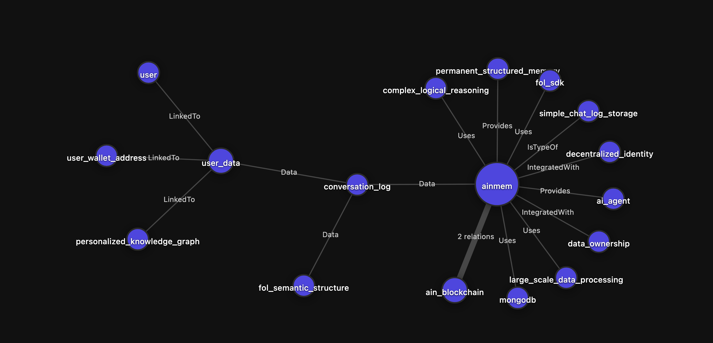

# AINMem

**Give Your AI Agents Infinite Memory**

AINMem is a knowledge graph platform that provides AI agents with permanent and structured memory. It transforms conversation logs into First-Order Logic (FOL) based semantic structures, enabling AI to understand relationships and context beyond simple conversation storage.



## Features

- **Knowledge Graph Visualization** - Interactive D3.js-powered graph showing relationships between entities
- **First-Order Logic Processing** - Extracts Constants (entities), Facts (truths), and Predicates (relationships) from conversations
- **Incremental Build** - Delta updates that only process new memories, preventing redundant computation
- **Blockchain Authentication** - Secure wallet-based login via AIN blockchain
- **User-Specific Memory** - Personalized knowledge graphs linked to wallet addresses

## Tech Stack

- **Framework**: Next.js 15 (App Router) with React 19
- **Database**: MongoDB via Mongoose
- **Styling**: Tailwind CSS 4 with CSS Modules
- **Visualization**: D3.js for knowledge graph rendering
- **Blockchain**: AIN blockchain integration (@ainblockchain/ain-js)
- **AI/NLP**: FOL-SDK with Gemini adapter

## Getting Started

### Prerequisites

- Node.js 20.x
- MongoDB instance
- Google Gemini API key

### Installation

```bash
# Clone the repository
git clone <repository-url>
cd ainmem

# Install dependencies
npm install
```

### Environment Variables

Create a `.env` file in the root directory:

```env
MONGODB_URI=your_mongodb_connection_string
GEMINI_API_KEY=your_gemini_api_key
```

### Development

```bash
npm run dev
```

Open [http://localhost:3000](http://localhost:3000) to view the application.

### Production

```bash
npm run build
npm start
```

## Project Structure

```
src/
├── app/
│   ├── api/                    # API routes
│   │   ├── fol/build/          # FOL build endpoint
│   │   └── users/[userId]/     # User-specific endpoints
│   ├── graph/                  # Knowledge graph page
│   ├── memories/               # Memories list page
│   └── page.tsx                # Landing page
├── components/                 # Reusable UI components
├── contexts/                   # React contexts (Auth)
├── lib/                        # Utilities (MongoDB, FOL store)
└── models/                     # Mongoose models
```

## Core Concepts

### Knowledge Graph Structure

- **Constants**: Entities extracted from conversations (people, places, things)
- **Facts**: True statements about entities
- **Predicates**: Relationships between entities

### Data Flow

1. User authenticates via wallet signature
2. Chat logs are stored in MongoDB
3. FOL-SDK processes documents to extract logical structures
4. D3.js renders the interactive knowledge graph

## License

© 2025 AINMem. All rights reserved.
